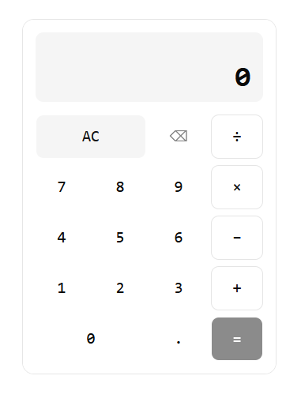
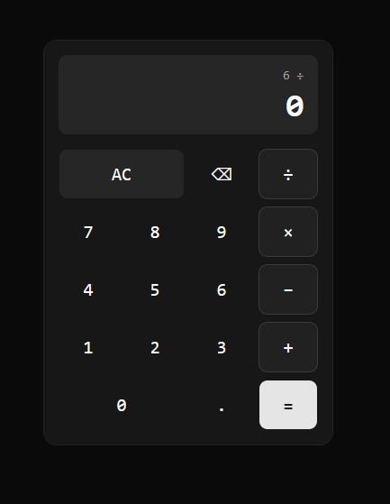
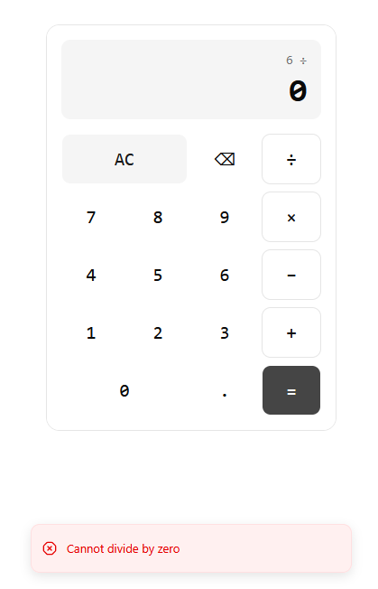
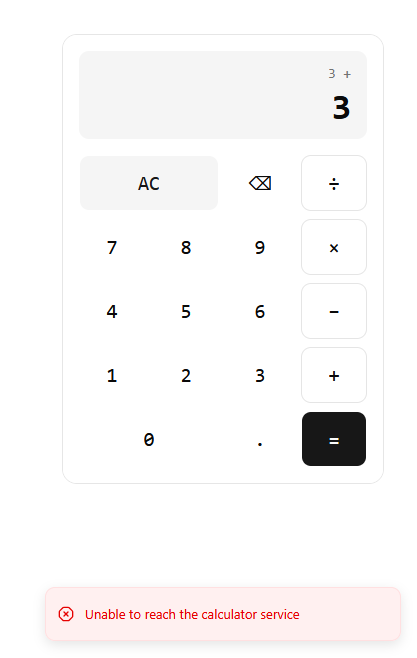

# Sezzle Code Challenge — Full-Stack Calculator

A full-stack calculator built for a frontend engineer technical assessment: a Go REST API performing arithmetic, consumed by a React frontend.

## Development Process

This project was built iteratively with [Claude Code](https://claude.com/claude-code) as an AI pair-programmer, one incremental feature/review pass at a time rather than a single generated dump. The full session transcript — every prompt, decision, and follow-up correction — is in [`PROMPT.md`](./PROMPT.md), included for transparency into how the codebase evolved and the reasoning behind the choices documented below.

## Status

- ✅ Backend (`api/`) — done
- ✅ Frontend (`web/`) — core calculator UI done
- ✅ Docker — done

## Screenshots

| Light theme | Dark theme |
|---|---|
|  |  |

| Backend-validated error | Network error |
|---|---|
|  |  |

## Project Structure

```
/
├── api/                    # Go backend (gin)
│   ├── main.go             # router setup, CORS, server bootstrap
│   ├── handlers/           # HTTP handlers, one per operation
│   ├── utils/               # pure arithmetic logic (decimal-based)
│   ├── models/               # request/response JSON structs
│   ├── .air.toml             # live-reload config (see below)
│   └── go.mod
├── web/                    # React + TypeScript frontend (Vite)
│   ├── src/
│   │   ├── components/       # Calculator, ThemeToggle, ThemeProvider, shadcn/ui primitives
│   │   ├── lib/               # API client, number formatting, cn helper
│   │   └── test/              # Vitest setup
│   ├── nginx.conf             # serves the built SPA in the Docker image
│   └── vite.config.ts        # includes Vitest `test` config
├── docker-compose.yml       # runs api + web together
├── Makefile                 # start-api, test-api, start-web, test-web targets
└── README.md
```

## Backend Setup

Requires Go 1.24+ (uses native `go.mod` tool dependencies).

```bash
make start-api
```

This runs the API with [air](https://github.com/air-verse/air) for live reload — it rebuilds and restarts automatically on any `.go` file change. Air is tracked as a repo-local tool dependency in `api/go.mod` (`go get -tool`), not installed globally.

The server listens on `:8080` by default. Override with the `PORT` env var. CORS defaults to allowing `http://localhost:5173` (the Vite dev server origin), overridable via `ALLOWED_ORIGIN`.

To run without live reload:

```bash
cd api && go run .
```

## Frontend Setup

Requires Node.js 20+.

```bash
cd web && npm install
make start-web
```

Vite dev server runs on `http://localhost:5173` by default. It expects the backend at `http://localhost:8080`; override with the `VITE_API_URL` env var (e.g. in `web/.env.local`) if the API runs elsewhere.

### Keyboard shortcuts

The calculator responds to a global `keydown` listener, so it works without clicking any buttons:

| Key(s) | Action |
|---|---|
| `0`–`9` | digit entry |
| `.` or `,` | decimal point |
| `+` `-` `*` `/` | operators |
| `Enter` or `=` | calculate |
| `Backspace` or `Escape` | clear everything (same as `AC`) |

Note the on-screen `⌫` button behaves differently — it deletes one character at a time — while the `Backspace` key clears the whole calculator.

## API Reference

All endpoints accept `POST` with a JSON body `{"a": <number>, "b": <number>}` and return `200 OK` with `{"result": <number>}` on success.

| Endpoint | Operation |
|---|---|
| `POST /api/add` | `a + b` |
| `POST /api/subtract` | `a - b` |
| `POST /api/multiply` | `a * b` |
| `POST /api/divide` | `a / b` |
| `GET /health` | health check, returns `200` |

### Examples

```bash
curl -X POST localhost:8080/api/add -H 'Content-Type: application/json' -d '{"a": 0.1, "b": 0.2}'
# {"result":0.3}

curl -X POST localhost:8080/api/divide -H 'Content-Type: application/json' -d '{"a": 10, "b": 3}'
# {"result":3.3333333333333335}
```

### Error cases

All errors return a `4xx` status with `{"error": "<message>"}`.

```bash
# Division by zero — 400
curl -X POST localhost:8080/api/divide -H 'Content-Type: application/json' -d '{"a": 5, "b": 0}'
# {"error":"Cannot divide by zero"}

# Missing field — 400
curl -X POST localhost:8080/api/add -H 'Content-Type: application/json' -d '{"a": 2}'
# {"error":"invalid request: expected numeric fields \"a\" and \"b\""}

# Non-numeric value — 400
curl -X POST localhost:8080/api/add -H 'Content-Type: application/json' -d '{"a": "x", "b": 3}'
# {"error":"invalid request: expected numeric fields \"a\" and \"b\""}
```

## Backend Testing & Coverage

```bash
make test-api
```

Current coverage: **100%** on `utils` (arithmetic), **84.4%** on `handlers`.

For an HTML coverage report:

```bash
cd api
go test ./... -coverprofile=coverage.out
go tool cover -html=coverage.out
```

## Frontend Testing & Coverage

```bash
make test-web
```

Runs [Vitest](https://vitest.dev/) with [React Testing Library](https://testing-library.com/react) (`vitest run --coverage`), covering the API client, number formatting, theme provider/toggle, and the calculator's UI logic (digit entry, keyboard shortcuts, chained operations, loading state, and error handling) end-to-end against a mocked API.

Current coverage: **~89%** statements, **~95%** lines.

An HTML coverage report is written to `web/coverage/index.html` after each run.

## Running with Docker

```bash
docker compose up --build
```

This builds and runs both services together:

- **`api`** — multi-stage build (`golang:1.26.4-alpine` → `gcr.io/distroless/static-debian12:nonroot`), exposed on `http://localhost:8080`.
- **`web`** — multi-stage build (`node:24-alpine` runs `npm run build`, then the static `dist/` output is served by `nginx:alpine`), exposed on `http://localhost:5173`.

The browser talks to the API directly (not through the web container), so `ALLOWED_ORIGIN` on the `api` service is set to `http://localhost:5173` to match. Stop everything with `docker compose down`.

## Design Rationale

- **gin**, per-operation REST endpoints (`/api/add`, `/api/subtract`, ...) rather than a single `/api/calculate` endpoint — keeps each handler small and single-purpose, and each is trivially testable via `net/http/httptest`.
- **`utils` package holds pure arithmetic functions** with no HTTP concerns, so the core logic is unit-tested in isolation from the transport layer.
- **`github.com/shopspring/decimal` for arithmetic**, not `float64`. Binary floating point can't represent most decimal fractions exactly (`0.1 + 0.2 == 0.30000000000000004` in raw float64 math), which is unacceptable for a calculator. Request bodies are parsed directly into `decimal.Decimal` (exact, no float64 in the loop) and all arithmetic runs in decimal space. The final result is converted to `float64` exactly once, at the JSON response boundary — safe because Go's JSON encoder uses shortest-round-trip formatting, so a clean decimal like `0.3` serializes back to `0.3`, not a long tail of noise.
- **Pointer fields (`*decimal.Decimal`) with `binding:"required"` on the request struct** — this correctly distinguishes a missing operand from an explicit `0`, which is a legitimate calculator input. A non-pointer zero value can't be told apart from "absent" by Go's validator.
- **Air for live reload**, added as a Go 1.24+ native tool dependency (`go get -tool`) rather than a global install, so the dev-only dependency is scoped to this repo and versioned in `go.mod`/`go.sum` like any other dependency.
- **All arithmetic happens on the backend.** The frontend never computes results locally — every operator press (including chained operations like `2 + 3 +`, which resolves the pending `2 + 3` first) calls the API. `src/lib/format-number.ts` only trims the display of float64 noise coming back from the JSON response (e.g. `10 ÷ 3`); it never re-derives a result.
- **shadcn/ui (Base UI primitives) + Tailwind v4** for the UI, added via the `shadcn` CLI rather than hand-rolled components, to keep the component code declarative and themeable through CSS variables (`src/index.css`) instead of ad hoc styling.
- **Monospace font scoped to the calculator only** (`font-mono` on the `Card`), with Inter as the app-wide sans font. Digits and operators need fixed-width alignment; body/UI text (like toast messages) reads better in a proportional font.
- **Errors surface as toasts (`sonner`), not inline alerts.** An inline error block that appears/disappears shifts the layout around it; a toast is non-blocking and doesn't lock the calculator — a failed `5 ÷ 0` leaves the operands in place so the user can fix and retry immediately, no forced reset required.
- **Theme toggle defaults to light**, persisted to `localStorage` via a small custom `ThemeProvider` (not `next-themes`, which assumes a Next.js/SSR setup this Vite app doesn't have).
- **Multi-stage Docker builds for both services**, so build toolchains (Go compiler, Node/npm) never ship in the final image. The API's runtime stage is `distroless/static` (no shell, no package manager, non-root) since it's a single static binary with no OS dependencies. The frontend's runtime stage is plain `nginx:alpine` serving the pre-built static `dist/`, not a Node server — there's nothing left to run server-side once Vite has bundled the SPA.
- **Keyboard input is a single global `keydown` listener**, not per-key-focused inputs — there's nothing else on the page competing for keyboard focus, so it maps keys straight onto the same handlers the on-screen buttons call. The keyboard `Backspace` clears everything (matches a physical calculator's expectation of "start over"), which is deliberately different from the on-screen `⌫` button's per-character delete.
